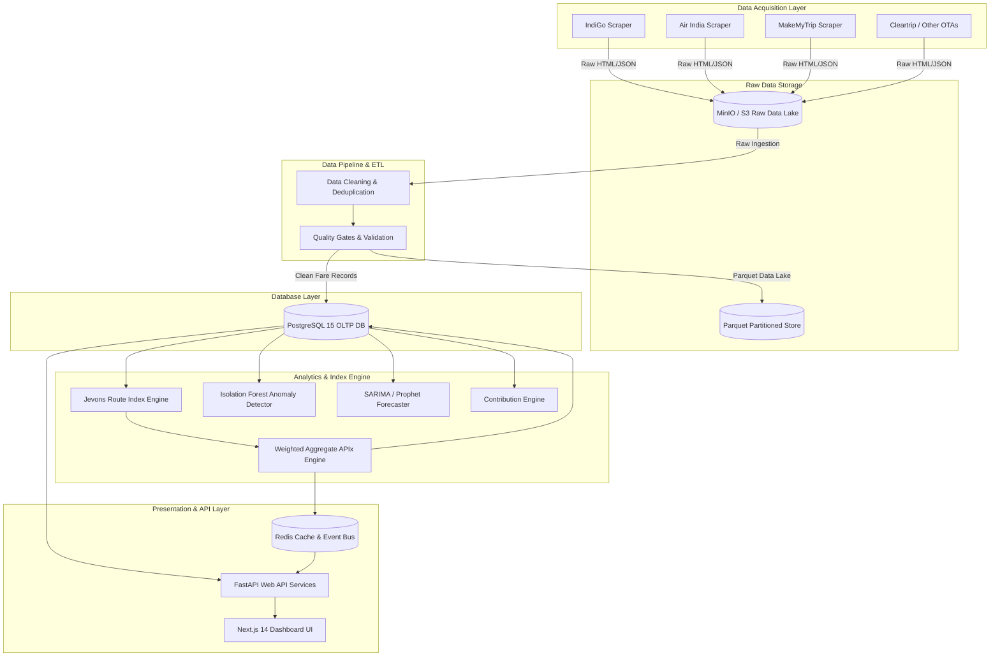

# 01 — System Architecture & Design Rationale

## 1. Problem Context & Objectives
Official inflation measurements in India (Consumer Price Index - CPI) rely heavily on offline survey collection methods for service sub-components like domestic air transport. This creates a 3 to 6-month time lag, making policy adjustments reactive rather than proactive.

**PROMETHEUS** resolves this lag by constructing a real-time domestic **Airfare Price Index (APIx)** for India through automated, resilient web scraping across official airline direct portals and Online Travel Aggregators (OTAs).

---

## 2. System Architecture Diagram

---

## 3. Technology Stack & Rationale

| Component | Technology | Version | Rationale |
|---|---|---|---|
| **Scraper Runtime** | Playwright (Python async) | `1.44.0` | Full headless browser automation capable of executing complex JavaScript applications and bypassing single-page app obstacles. |
| **Data Lake Store** | MinIO / S3 | `7.2.7` | High-performance, S3-compliant object store providing immutable raw HTML payload storage for audit trails. |
| **Columnar Format** | Apache Parquet (`pyarrow`) | `16.1.0` | Optimized storage footprint and ultra-fast analytical read query performance for high-volume fare history. |
| **Relational Database**| PostgreSQL | `15` | Acid-compliant relational engine for persistent index store, clean observations, alerts, and metadata. |
| **Database ORM** | SQLAlchemy | `2.0.30` | Modern Python ORM featuring native asyncpg support for high-throughput non-blocking queries. |
| **Index Engine** | Pure Python + NumPy / Pandas | `1.26.4` | High-precision vectorised geometric mean calculations (Jevons index formula). |
| **Web API Engine** | FastAPI | `0.111.0` | Asynchronous, OpenAPI-native framework delivering low-latency endpoint responses. |
| **Caching & Messaging**| Redis | `7.0` | In-memory key-value cache for index time-series and pub/sub broker for real-time alerts. |
| **Frontend Framework** | Next.js (App Router) | `14` | Server-rendered React framework providing optimal performance, SEO, and dynamic charting capabilities. |
| **Orchestration** | Prefect | `3.0` | Modern pythonic workflow automation handling scheduling, retries, and task dependency graphs. |
| **Anomaly Detection** | Scikit-Learn (Isolation Forest) | `1.5.0` | Unsupervised ML tree ensemble optimized for multidimensional outlier detection in fare data. |
| **Forecasting** | Statsmodels / Prophet | `0.14.2` | Robust time-series decomposition modeling weekly and seasonal holiday domestic travel patterns. |

---

## 4. End-to-End Data Flow Narrative

1. **Scraping**: Scheduled scrapers launch via Prefect, initiating headless Chromium browsers that query 30 primary Indian flight routes across multiple departure dates (1 to 30 days ahead).
2. **Raw Storage**: Raw HTML and JSON responses from airline servers are saved to MinIO (`prometheus-raw`) named by timestamp and route for auditing.
3. **ETL Processing**: The ETL engine cleans the payload, validates tax vs base fare breakdowns, converts timestamps to UTC, deduplicates observations using a 5-minute fuzziness window, and evaluates quality thresholds.
4. **Clean Storage**: Validated observations are written to PostgreSQL and archived into Parquet partitions (`prometheus-parquet`).
5. **Index Computation**: The Index Engine computes Jevons geometric price relatives for each route against base-period prices and calculates national APIx using DGCA passenger-volume weights.
6. **ML & Analytics**: Isolation Forest flags anomalous pricing behavior while contribution models score root causes of index shifts.
7. **Presentation**: Results are cached in Redis and served via FastAPI endpoints to the Next.js dashboard and alerting triggers.

---

## 5. Index Methodology: Jevons Formula

The **Jevons Index** is an unweighted geometric mean of price relatives. It is specified internationally by the ILO/IMF Consumer Price Index Manual as the optimal elementary aggregate formula due to its resilience against substitution bias.

For a route $r$ at time $t$ with $N$ observed flight offers compared to base period $0$:

$$I_t^r = \prod_{i=1}^{N} \left( \frac{P_{i,t}}{P_{i,0}} \right)^{\frac{1}{N}} = \exp \left( \frac{1}{N} \sum_{i=1}^{N} \ln \left( \frac{P_{i,t}}{P_{i,0}} \right) \right)$$

The aggregate **National Airfare Price Index ($APIx_t$)** across all $R$ routes is computed as a weighted geometric mean using DGCA route passenger volume weights $w_r$:

$$APIx_t = \prod_{r=1}^{R} \left( I_t^r \right)^{w_r} \quad \text{where} \quad \sum_{r=1}^{R} w_r = 1.0$$

---

## 6. Risk Mitigation & Resilience

- **Anti-Scraping Defenses**: Mitigated using Playwright stealth configurations, randomized user agents, realistic viewports, and intelligent request spacing.
- **Data Quality Disruption**: Mitigated through mandatory quality gates (minimum 85% data completeness check before index update).
